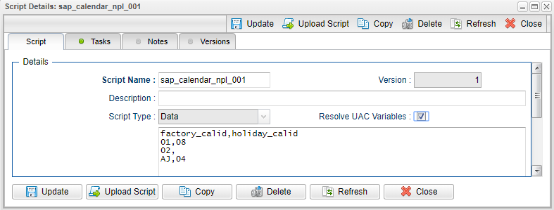
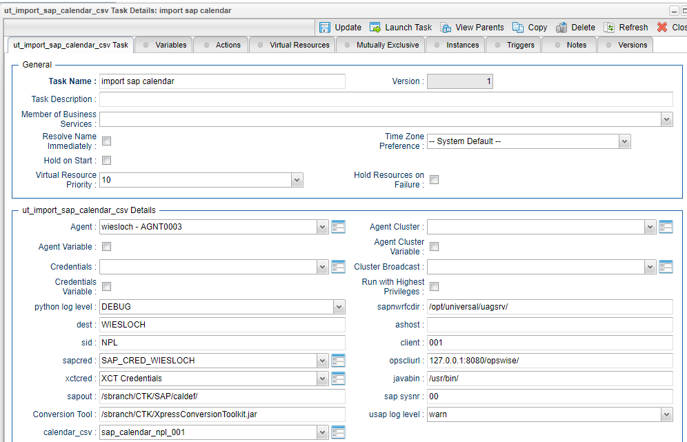
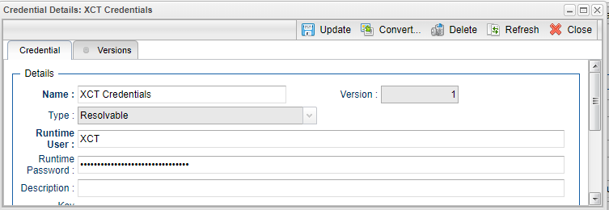
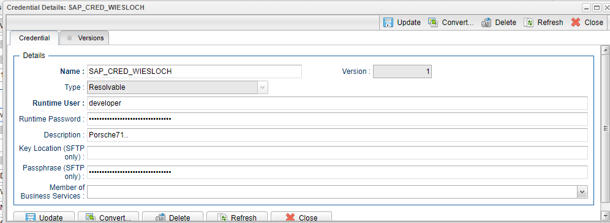
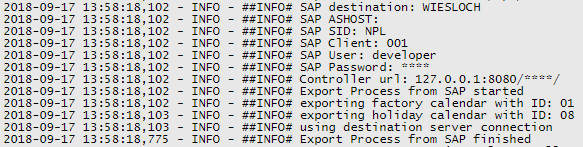
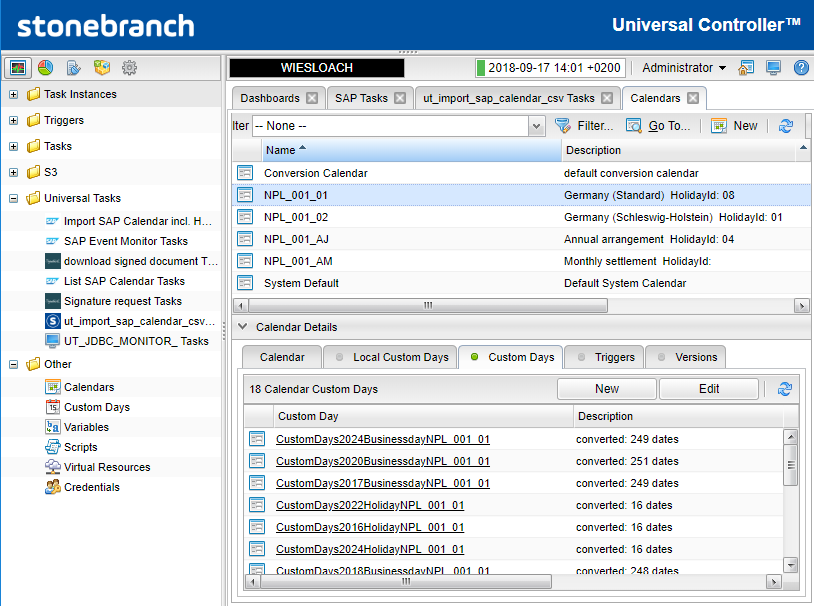
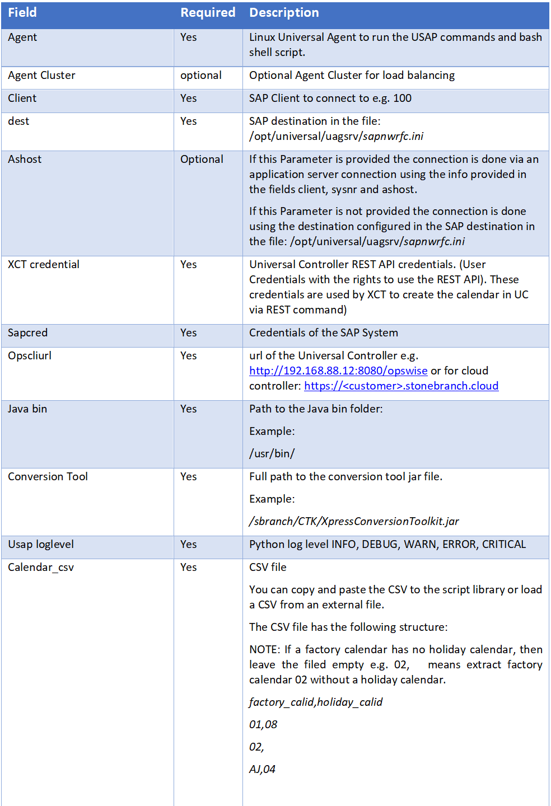
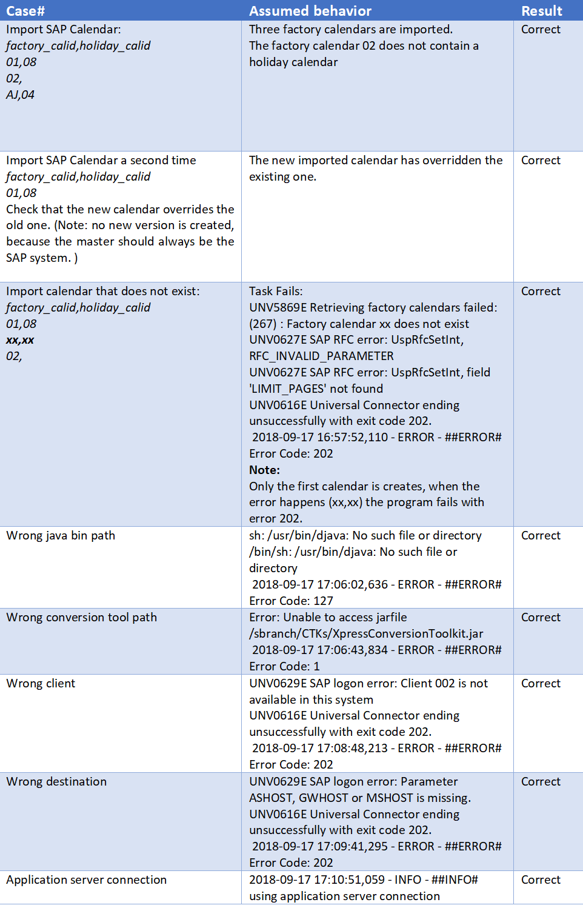
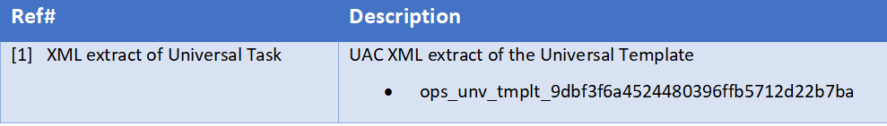

# ut-sap-import-calendar-csv-linux
The following Universal Task allows to mass import SAP calendar into Universal Automation Center. The task is useful for any customer scheduling SAP with our Controller. It will allow to schedule SAP task without the need of regular manual lookups of the calendar in SAP.

# Abstract: 

This Universal Task allows to mass import SAP calendar into Universal Automation Center. The SAP calendar to import are provided by a 
CSV file loaded to the Universal Controller script library. After the import the SAP calendar are available as Universal Automation 
Center Calendar.

# 1	Disclaimer

No support and no warranty are provided by Stonebranch GmbH for this document and the related Universal Task. The use of this document 
and the related Universal Task is on your own risk.

Before using this task in a production system, please perform extensive testing.

Stonebranch GmbH assumes no liability for damage caused by the performance of the Universal Tasks

# 2	Introduction

The here described Universal Task allows to mass import SAP calendar into Universal Automation Center. The SAP calendar to import are 
provided by a CSV file loaded to the Universal Controller script library. After the import the SAP calendar are available as Universal 
Automation Center Calendar.

The Universal Task uses the Conversion Toolkit (XCT) to create the extracted SAP calendar in Universal Controller.

Some details about the universal task to import SAP calendar:
-	The Universal Task extracts the SAP calendar via the SAP certified UASP connector using XBP
-	The SAP calendar to import can be provided via a CSV file loaded to the Universal Controller Script library 
-	The Universal Task uses the Conversion Toolkit (XCT) to create the extracted SAP calendar in Universal Controller, by calling the 

Universal Controller REST API
-	The import can be scheduled via a Time Trigger e.g. import every day the sap calendar. 
-	The Universal Task supports both Universal Agent for Linux/Unix and Windows. (Note: the attached Task has only been tested on Linux))
-	You can select different log-levels e.g. Info and debug
-	All Passwords are encrypted using Controller Credentials

# 3	Installation

# 3.1	Requirements for Linux Agent

Universal Template name: ut-sap-import-calendar-csv-linux

Related UAC XML Files for template and task: [1]: 
-	Python 2.7.x installed on a Linux server where a Universal Agent is installed. 
-	For Python the following modules are required: 
    -	sys, for output re-direct processing
    -	datetime, date and time stamps for messages
    -	requests to perform the REST API calls
    -	logging, for python loglevel support
    -	CSV, to parse the input file
-	Universal Controller V6.4.7.0 or higher
-	Universal Agent V6.4.2.2 or higher installed on a Linux Server
-	Conversion Tool Kit XCT Version 64412 (or higher) installed on the Linux Sever, where the Universal Agent is installed.
-	Oracle Java jdk8 installed on the Sever where the Conversion Tool Kit XCT is installed. 

# 3.2	Installation Steps

The following describes the installation steps:

**1.	Install JAVA JDK **

Check the java version on you server: java -version

If you do not have oracle jdk8 (Note: Open JDK will not work due to missing JAVA FX Libraries)

download the Oracle Java jdk8 rpm from the oracle homepage:

http://www.oracle.com/technetwork/java/javase/downloads/jdk8-downloads-2133151.html

**stall the rpm:**

rpm -ivh jdk-8u181-linux-x64.rpm (or use your package installer)

The SAP calendar export Universal Task has an option to Point to this new JAVA ( or an existing one)

**2.	Install Conversion Toolkit XCT**

-	Copy the installation files: unzip xct64412.zip to folder e.g. /sbranch/CTK/
-	Unzip the installation files: unzip xct64412.zip

Result: The jar file for the XCT is available in the folder: /sbranch/CTK/XpressConversionToolkit.jar

**3.	Install Python 2.7.x  for Linux on the Linux Server running the Universal Agent.**

Official Download link: https://www.python.org/downloads/
Note: The check the current Python Version type in a shell: python -V (capital V)

**4.	Add the required python modules**

In a command shell as sudo or root:
-	pip install requests

It is assumed that the modules csv, logging, sys, datetime are already available. If not install them via pip.
 
**5.	Import the Universal Task including the Universal Template to your Controller**

Go to “All Tasks” and load via the Import functionality the Universal Task configuration into the Controller. 

# 4	Universal Task Configuration

**1.	Activate: Resolvable Credentials in Universal Automation Center properties:**

**2.	Create the CVS file to import SAP Calendar**

You can copy and paste the CSV to the script library or load a CSV from an external file.
The CSV file has the following structure:
NOTE: If a factory calendar has no holiday calendar, then leave the filed empty e.g. 02,   means extract factory calendar 02 without a holiday calendar.

factory_calid,holiday_calid
01,08
02,
AJ,04

**Example:**

**3.	Fill Out the Universal Task to import SAP calendar based on a csv file**

**Credential for Universal Task:**

REST API Credentials:

SAP Connection Credentials:

Task Output:

**Result in Universal Controller:**

After the import the calendar is imported in the Universal Controller.

Example: NPL_001_01

Means Factory Calendar 01 has been imported from SAP SID: NPL Client 001

The imported Calendar consists of CustomDays List of Type workday and holiday.

**Description:**

# 5	Test Cases

The following basic test cases has been performed:

 

# 6	Document References

This document references the following documents:

